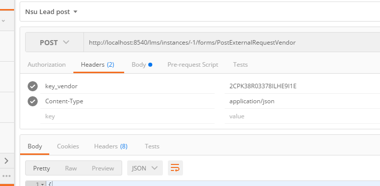

Welcome to Nsu Lead Service!
----------------------------


Nsu lead services is an webservice that is provider for Private Florida Research University | Nova Southeastern University. To send leads in our system

Current version:  v0.0.1

http://localhost:8540/lms/instances/-1/forms/PostExternalRequestVendor


Get started
-------------

First of all you need an api key, you can get youe own key on vendor section:


> **Note:**

> - This key must be saved properly.
> - If you send multiple times the same info the system is going to reject the repeated data.

Test endpoint
------

You can test our endpoint using postman we prepare an example in this link:

To do:


 Set your header key


 
  Create a body with the request (See in this documentation the option available fields)
 


[](https://app.getpostman.com/run-collection/9cab812a5b4648e1b107)


 

Languajes suport examples
-------------------------

Javascript
----------

.

Ajax
----

```js

var settings = {
  "async": true,
  "crossDomain": true,
  "url": 'currenturl',
  "method": "POST",
  "headers": {
    "key_vendor": "YOURKEY",
    "content-type": "application/json",
  },
  "processData": false,
  "data": "DATA"
}
```

C Sharp
----

```js
var client = new RestClient("http://localhost:8540/lms/instances/-1/forms/PostExternalRequestVendor");
var request = new RestRequest(Method.POST);
request.AddHeader("cache-control", "no-cache");
request.AddHeader("content-type", "application/json");
request.AddHeader("key_vendor", <KEY>);
request.AddParameter("application/json", <JSON-STRINGIFY>, ParameterType.RequestBody);
IRestResponse response = client.Execute(request);

```

JAVA
----

```js
HttpResponse<String> response = Unirest.post("http://localhost:8540/lms/instances/-1/forms/PostExternalRequestVendor")
  .header("key_vendor", <Key>)
  .header("content-type", "application/json")
  .header("cache-control", "no-cache")
  .body(<JSON-STRINGIFY>)
  .asString();

```

NODE
----

```js
var request = require("request");

var options = { method: 'POST',
  url: 'http://localhost:8540/lms/instances/-1/forms/PostExternalRequestVendor',
  headers: 
   { 'postman-token': '562efb8f-f648-a6e5-16ef-4821730d2d37',
     'cache-control': 'no-cache',
     'content-type': 'application/json',
     key_vendor: <KEY> },
  body: 
   <JSON-OBJECT>,
  json: true };

request(options, function (error, response, body) {
  if (error) throw new Error(error);

  console.log(body);
});


```
